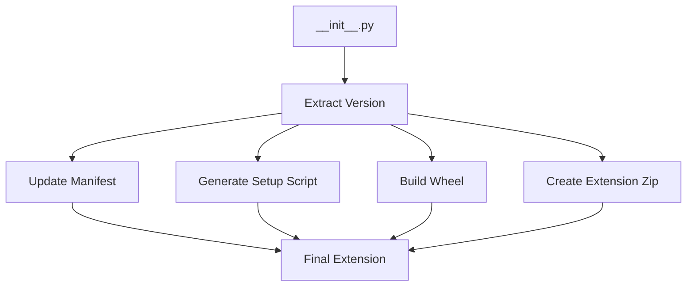

# Molecular Plus - Version Management Guide

## Single Source of Truth for Versioning

The Molecular Plus project now uses a **single source of truth** for version management. All version numbers are automatically derived from the `__init__.py` file, eliminating version inconsistencies and maintenance overhead.

## How It Works

### 1. Primary Version Source
**File:** `__init__.py`
```python
bl_info = {
    "name": "Molecular+",
    "version": (1, 18, 0),  # ← SINGLE SOURCE OF TRUTH
    # ... other fields
}
```

### 2. Automatic Version Propagation
All build scripts automatically extract and use this version:

- **Extension Version:** `1.18.0` (from bl_info tuple)
- **Core Library Version:** `1.18.0.1` (extension version + `.1`)
- **Manifest Version:** Automatically updated during build
- **Wheel Filenames:** Dynamically generated with correct version

## Version Update Process

### To Update the Version:
1. **Edit ONLY `__init__.py`:**
   ```python
   "version": (1, 19, 0),  # Update this line only
   ```

2. **Run the build scripts** - they automatically use the new version:
   ```bash
   python pack_molecular_optimized.py        # For x86_64
   python pack_molecular_optimized_arm64.py  # For ARM64
   ```

3. **Everything else updates automatically:**
   - ✅ `blender_manifest.toml` version
   - ✅ Core library version (`1.19.0.1`)
   - ✅ Wheel filenames
   - ✅ Extension zip names

## Build Scripts Enhanced

### Features Added:

#### 1. Version Extraction Function
```python
def get_version_from_init():
    """Extract version from __init__.py bl_info"""
    # Reads __init__.py and extracts version tuple
    # Converts (1, 18, 0) → "1.18.0"
```

#### 2. Automatic Manifest Updates
```python
def update_manifest_version(version):
    """Update the version in blender_manifest.toml"""
    # Updates version field in manifest
    # Updates wheel references to match new version
```

#### 3. Dynamic Setup Generation
- Core version automatically calculated as `{version}.1`
- Setup scripts generated with correct version numbers
- No hardcoded versions in build process

## File Structure

### Version-Controlled Files:
```
📁 Project Root
├── __init__.py                    ← PRIMARY VERSION SOURCE
├── blender_manifest.toml          ← Auto-updated during build
├── pack_molecular_optimized.py    ← Reads from __init__.py
├── pack_molecular_optimized_arm64.py ← Reads from __init__.py
└── c_sources/
    └── build_optimized.py         ← Reads from __init__.py
```

### Generated Files (Auto-versioned):
```
📁 Build Output
├── molecular-plus-optimized_1.18.0_311_macos_x64_sse4.2.zip
├── molecularplus/
│   ├── blender_manifest.toml      ← Version updated automatically
│   └── wheels/
│       └── molecular_core-1.18.0.1-cp311-cp311-macosx_11_0_x86_64.whl
└── c_sources/
    ├── setup_optimized.py         ← Generated with correct version
    └── molecular_core/            ← Built with version 1.18.0.1
```

## Benefits

### ✅ **Consistency**
- No version mismatches between components
- Single point of truth eliminates confusion
- All files automatically synchronized

### ✅ **Maintenance**
- Update version in ONE place only
- No need to remember multiple files
- Reduced chance of human error

### ✅ **Automation**
- Build scripts handle all version propagation
- Manifest files updated automatically
- Wheel names generated correctly

### ✅ **Reliability**
- Fallback versions if extraction fails
- Error handling for missing files
- Clear logging of version operations

## Build Process Flow



## Example Build Output

```bash
======================================================================
MOLECULAR PLUS - OPTIMIZED WHEEL BUILDER
======================================================================
Version: 1.18.0 (from __init__.py)          ← Extracted automatically
System: Darwin x86_64
Python: 3.11
CPU Features: SSE4.2
Architecture: _x64

Copying addon files...
  ✅ blender_manifest.toml
  ✅ __init__.py
  # ... other files

Updating manifest version...
  ✅ Updated blender_manifest.toml version to 1.18.0  ← Auto-updated

Building optimized wheel for version 1.18.0...
Building optimized wheel...
✅ Wheel build completed successfully!
  📦 Moved wheel: molecular_core-1.18.0.1-cp311-cp311-macosx_11_0_x86_64.whl

Creating Blender extension: molecular-plus-optimized_1.18.0_311_macos_x64_sse4.2.zip

🎉 OPTIMIZED BLENDER EXTENSION CREATED SUCCESSFULLY!
```

## Troubleshooting

### Version Extraction Issues:
```bash
⚠️  Could not extract version from __init__.py, using fallback
```
**Solution:** Check that `__init__.py` contains properly formatted `bl_info` with version tuple.

### Manifest Update Issues:
```bash
⚠️  Error updating manifest version: [error]
```
**Solution:** Ensure `blender_manifest.toml` exists and is writable.

### Build Script Issues:
```bash
⚠️  Error reading version from __init__.py: [error]
```
**Solution:** Verify `__init__.py` exists and contains valid Python syntax.

## Migration from Old System

### Before (Multiple Sources):
- `__init__.py`: `(1, 17, 21)`
- `blender_manifest.toml`: `"1.17.21"`
- `build_optimized.py`: `"1.17.21.1"`
- `pack_molecular_optimized.py`: `"1.17.21.1"`

### After (Single Source):
- `__init__.py`: `(1, 18, 0)` ← ONLY place to update
- All other files: Auto-updated during build

## Best Practices

### ✅ **Do:**
- Update version only in `__init__.py`
- Use semantic versioning (major.minor.patch)
- Test build after version changes
- Verify generated files have correct versions

### ❌ **Don't:**
- Manually edit `blender_manifest.toml` version
- Hardcode versions in build scripts
- Skip version verification after builds
- Use inconsistent version formats

## Version History

- **v1.18.0** - Implemented single source of truth versioning
- **v1.17.21** - Previous manual version management

---

**The single source of truth versioning system ensures consistency, reduces maintenance overhead, and eliminates version-related errors in the build process.**